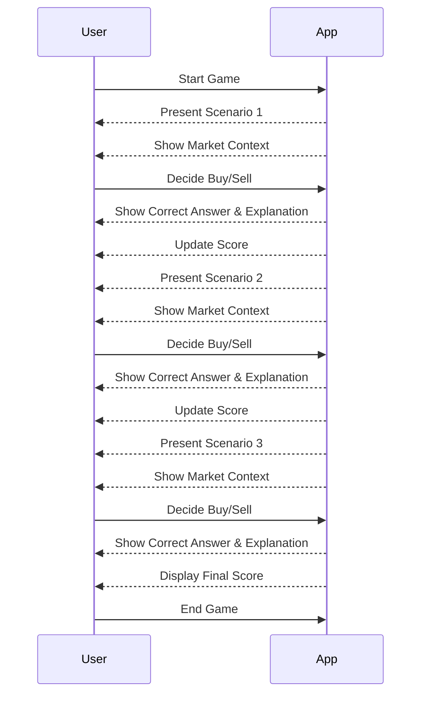

# Welcome to NewsPaperTrade!

Hi! This project **NewsPaperTrade** was made for the 2024 Code Overflow Hackathon.

# Features
**NewsPaperTrade** has two main features.
1. Stock market Simulator

2. Education Hub
Various information about investing and trading concepts are displayed. Information was aggregated from reputable sources such as https://www.investopedia.com/ 
